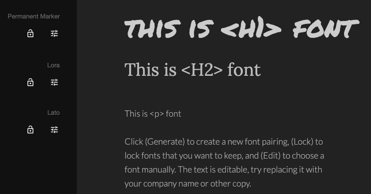
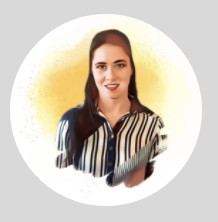
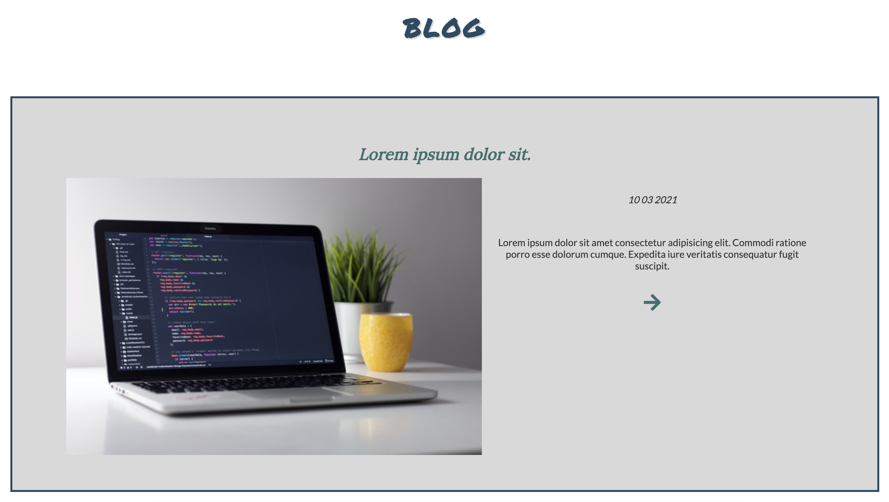
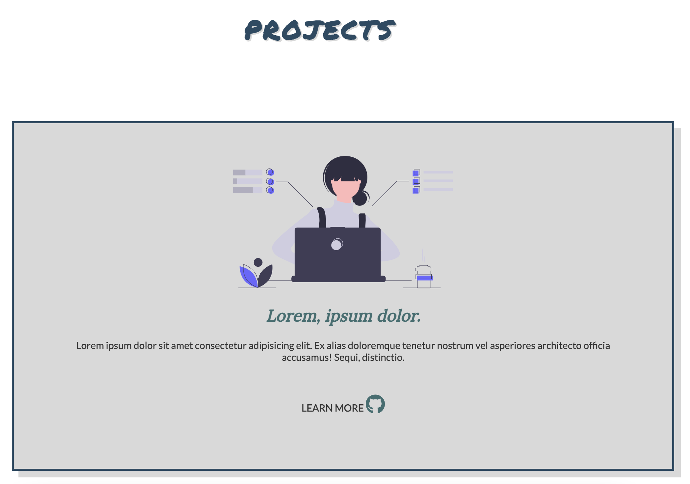
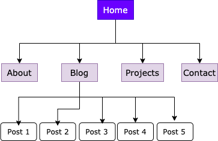

# T1A2 - Portfolio
This repository showcases some of Vanessa's skills as a Web Developer student as an assignment of the Coder Academy Fast Track program class in Melbourne, 2021.

# Table of Contents
- [Purpose](#purpose)
- [Target audience](#target-audience)
- [Functionality and Features](#functionality-and-features)
    - [Design](#design)
    - [Logo](#logo)
    - [Call to Action](#call-to-action)
    - [Images](#images)
    - [Blog](#blog)
    - [Contact Information](#contact-information)
    - [Information about Me](#information-about-me)
    - [Content](#content)
    - [Relevant social media accounts](#relevant-social-media-accounts)
    - [Relevant projects](#relevant-projects)
- [Sitemap](#sitemap)
- [Tech Stack](#tech-stack)
    - [HTML5 & CSS](#html5-&-css)
    - [Git](#git)
    - [Netlify](#netlify)
    - [Lighthouse](#lighthouse)
- [Credits](#credits)

## Purpose
This website portfolio is an extension of the curriculum of Web Development student Vanessa Denardin, bringing information about knowledge, skills, hobbies, aspirations and projects that Vanessa has been doing over the years.

## Target audience
The website portfolio seeks to attract the interest of potential employers, presenting Vanessa Denardin's professional experiences and skills, as well as being a way to connect with other IT professionals, expanding networking and learning opportunities.

## Functionality and Features
### Design
As I have no design experience, I looked for trending colour schemes using white as the basis for a grey-green gradient. I chose the one that best suited the professional image I am trying to convey.
The chosen typography combined with each other according to a Google search.

- `<h1>`: Permanent Marker was used due to its format similar to that of writing, reflecting a personal characteristic of preference in making notes, reminders, daily lists.

- `<h2>`: Lora was adopted due to the captivating appearance of the curves still referring to the handwriting aspect.

- `<p>`: used mainly in the content of the about page, projects page and blog page, Lato typography was adopted due to its easy-to-read format.



On all pages, rectangular elements were used to highlight the content, seeking to represent the seriousness given to the projects that I have been proposing to participate in throughout my professional training.

No animation was added at this stage, as it makes no sense in the intention that the portfolio seeks to convey.


### Logo
For the logo I opted for a more traditional and friendly look, adopting the circle, in addition to being formed by curves that refer to femininity.



### Call to Action
In addition to the social media icons on all pages linked to personal accounts, the "get in touch" button added to the about page and the "send" button just below the contact form were added to reinforce the desire to connect with potential employers and other professionals.

### Images
On personal pages (Homepage and About Page), I tried to use the highest quality images to represent my personality and my work, but for the other pages, I used Unsplash images, because I still don't have enough experience to use my own projects and the pages are still in progress.

### Blog
The blog was designed to compile and expose my reflections, my goals and how I overcame obstacles when entering a professional area totally different from the one I dedicated myself to in the last years.



### Contact information
To simplify things, on the contact page I added a simple contact form where the user just needs to add name, email and a message that will be sent automatically to my e-mail.
In addition, if the user visits the about page, he will find a link redirecting to the contact page.
Moreover, on each page are my social networks present to connect and my resume to dowload.

<!-- contact page -->

### Information about me
Pages like Homepage, About and Projects should, as a function, introduce me to the users of the site. it will be an opportunity for me to pass on information such as education and training, work, projects that I am developing, skills, hobbies, expectations, among others.

<!-- about me -->

### Content
All the content produced on the page will aim to establish a real connection with users, sharing real information, explaining how projects and professional skills developed and how I overcame the challenges along the way.

### Relevant social media accounts
Professional network accounts (GitHub and LinkedIn) have been added to all the portfolio pages to promote contact with the visitor, but also to expose the types of projects I am developing and my interests.


### Relevant projects
The projects page was designed to add the projects that I will develop throughout the Coder Academy Fast Track program and then also add professional projects. Having an image, an overview of the project and its link to GitHub.



## Sitemap
The sitemap was developed linking the root (Home) with all other pages, namely About, Projects, Blog, Contact, as shown below. The Blog page is connected to all the articles developed.



## Tech Stack
### HTML5 & CSS
Although the assignment does not limit the use of technology stack, I choose to use HTML5 (Hypertext Markup Language) and pure CSS (Cascading Style Sheets) to style as pages. The code style adopted follows the instructions of the classes and the T1A2 assignment using semantic HTML5 and styling with CSS. Using CSS properties to target HTML elements and modify their appearance. 

For each page:
```html
<!DOCTYPE html>
<html lang="en">
    <head>
        <meta charset="UTF-8" />
        <meta http-equiv="X-UA-Compatible" content="IE=edge" />
        <meta name="viewport" content="width=device-width, initial-scale=1.0" user-scalable=false/>
        <title>Vanessa's Portfolio</title>
        <link rel="stylesheet" href="css/style.css" />
        <link rel="stylesheet" href="css/home.css" />
        <link rel="preconnect" href="https://fonts.gstatic.com">
        <link href="https://fonts.googleapis.com/css2?family=Lato&family=Lora:wght@500&family=Permanent+Marker&display=swap" rel="stylesheet">
    </head>
```
### JavaScript
Although it was not yet learned in class, JavaScript was suggested as an approach to make the navigation bar more responsive. So I used the code available on the instructor's repository GitHub, making the modifications that fit my website portfolio.

### Git
used for source code management tracking changes made to the website portfolio files, as well as to record that could allow me to revert to a specific version when needed.

### Netlify
As suggested in class, Netlify, an open source platform, was used to deployment the website portfolio.

### Lighthouse
In order to enhancce the performance of the website, another open source platform, Google Lighthouse, was used to check overall performance and make corrections to the accessibility in the portfolio.

## Credits
- Sitemap Maker
    - https://app.diagrams.net/

- Font types
    - https://fontjoy.com/#

- Color Scheme
    - https://coolors.co/353535-3c6e71-ffffff-d9d9d9-284b63

- Inspirations
    - Monica Powell - https://www.aboutmonica.com/
    - Adham Dannaway - https://www.adhamdannaway.com/
    - Olivier Guilleux - https://www.olivier-guilleux.com

- Wireframe Editor
    - https://ninjamock.com/

- Images used on the website portfolio
    - Clément Hélardot - https://unsplash.com/photos/95YRwf6CNw8
    - Kevin Ku - https://unsplash.com/photos/w7ZyuGYNpRQ
    - Roman Synkevych - https://unsplash.com/photos/vXInUOv1n84
    - Safar Safarov - https://unsplash.com/photos/MSN8TFhJ0is
    - Social Mode - https://unsplash.com/photos/WmVtCFR1C1g
    - https://undraw.co/
